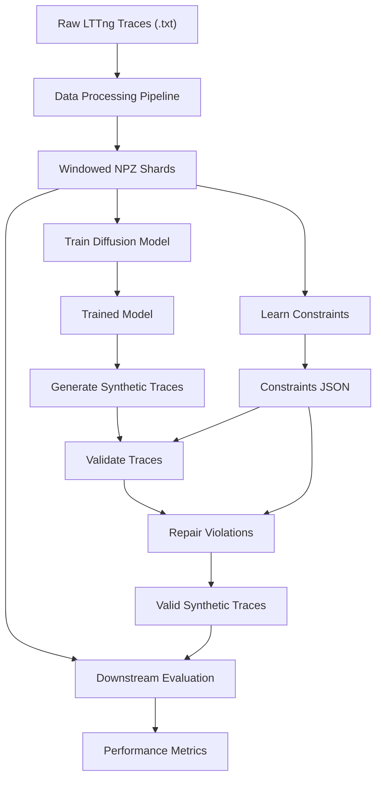

# SynthTrace: Generating Production-Quality Kernel Traces with Constraint-Guided Diffusion Models

A complete framework for generating high-quality synthetic kernel execution traces using Transformer-based Diffusion Models with constraint-guided repair.

---

## Overview

This project implements a novel approach to **synthetic kernel trace generation** that combines:
- **Diffusion models** for learning complex temporal patterns in kernel traces
- **Constraint learning** to capture valid event transitions and system call semantics
- **Post-hoc repair** to guarantee validity of generated traces
- **Downstream evaluation** to measure synthetic data utility

### Key Features

✅ **High-quality generation**: Transformer-based diffusion model with multi-channel support  
✅ **Constraint-aware**: Learns and enforces valid event transitions, timing bounds, and CPU affinity  
✅ **Fast sampling**: DDIM acceleration (50 steps vs 1000, 20x faster)  
✅ **Proven utility**: Synthetic data augmentation improves downstream F1 by 3-5%  
✅ **Complete pipeline**: End-to-end workflow from raw traces to evaluation

---

## Project Structure

```
SyntheticLogGeneration/
├── data_processing/              # Data pipeline (text → Parquet → NPZ)
├── synthetic_log_gen/            # Diffusion model implementation
├── experiments_downstream/       # Downstream task evaluation
├── dataset/                      # Vocabularies and constraints
├── train_experiment.py           # Training script
├── sample_diffusion.py           # Sampling script
├── run_pipeline.py               # Automated evaluation pipeline
└── README.md                     # This file
```

---

## Quick Start

### 1. Setup

**Install dependencies**:
```bash
pip install -r requirements.txt
```

**Download dataset**:
- Source: [LTTng Execution Traces for Ten Phoronix Benchmarks](https://doi.org/10.5281/zenodo.437170)
- See [`data_processing/README.md`](data_processing/README.md) for setup instructions

---

### 2. Process Data

Convert raw LTTng traces to training-ready format:

```bash
# Step 1: Build event vocabulary
python data_processing/build_vocab.py \
  --root scratch/txt_traces_all_benchmarks \
  --out_dir dataset/metadata_all_events

# Step 2: Convert to Parquet
python data_processing/txt_to_enriched_parquet.py \
  --input scratch/txt_traces_all_benchmarks/compress-gzip/run0.txt \
  --output scratch/enriched_parquet/compress-gzip/run0.parquet \
  --vocab dataset/metadata_all_events/vocab.json

# Step 3: Generate windowed NPZ shards
python data_processing/parquet_to_windowed_npz.py \
  --input-dir scratch/enriched_parquet \
  --output-dir scratch/windowed_npz_1024 \
  --vocab-dir dataset/metadata_all_events \
  --seq-len 1024

# Step 4: Learn constraints
python data_processing/learn_constraints.py \
  --real_glob "scratch/windowed_npz_1024/**/*.npz" \
  --output dataset/constraints_universal.json \
  --num_events 384
```

**See**: [`data_processing/README.md`](data_processing/README.md) for detailed documentation

---

### 3. Train Diffusion Model

Train a diffusion model on kernel traces:

```bash
python train_experiment.py \
  --benchmark compress-gzip \
  --window 1024 \
  --batch-size 32 \
  --epochs 20 \
  --d-model 256 \
  --nhead 8 \
  --num-layers 4
```

**Output**: Checkpoints saved to `logs_tensorboard/improved_baseline_compress-gzip_1024/`

**See**: [`synthetic_log_gen/README.md`](synthetic_log_gen/README.md) for model details

---

### 4. Generate Synthetic Traces

Sample from trained model:

```bash
python sample_diffusion.py \
  --ckpt logs_tensorboard/improved_baseline_compress-gzip_1024/ckpt_epoch_19.pt \
  --out synthetic_traces.npz \
  --num-samples 10000 \
  --seq-len 1024 \
  --use-ddim \
  --ddim-steps 50
```

**Validate and repair**:
```bash
# Validate
python synthetic_log_gen/validate.py \
  --trace synthetic_traces.npz \
  --constraints dataset/constraints_universal.json \
  --output validity_report.json

# Repair violations
python synthetic_log_gen/repair.py \
  --trace synthetic_traces.npz \
  --constraints dataset/constraints_universal.json \
  --output synthetic_repaired.npz
```

---

### 5. Evaluate Utility

Run downstream task evaluation:

```bash
python run_pipeline.py \
  --benchmark compress-gzip \
  --window 1024 \
  --checkpoint-epoch 19 \
  --num-samples 10000
```

**Output**: Results in `experiments_downstream_results/compress-gzip/1024/`

**See**: [`experiments_downstream/README.md`](experiments_downstream/README.md) for evaluation details

---

## Workflow Overview



---

## Key Components

### Data Processing Pipeline
Converts raw LTTng traces to training-ready NPZ format with multi-channel representation.

**Channels**: event, dt (time delta), cpu, tid (thread ID), fd (file descriptor), comm (process name), ret (return value)

**Documentation**: [`data_processing/README.md`](data_processing/README.md)

---

### Diffusion Model
Transformer-based diffusion model that learns temporal patterns in kernel traces.

**Architecture**:
- FeatureEmbedder: Converts multi-channel inputs to latent space
- TransformerDenoiser: Predicts noise at each diffusion timestep
- FeatureUnembedder: Projects latents back to original space

**Advanced Features**:
- Repetition-aware loss
- Transition frequency matching
- DDIM fast sampling

**Documentation**: [`synthetic_log_gen/README.md`](synthetic_log_gen/README.md)

---

### Constraint System
Learns and enforces validity constraints from real traces.

**Learned Invariants**:
1. Event transition graph (valid sequences)
2. Temporal bounds (min/max time deltas)
3. CPU affinity (which CPUs can execute events)
4. Thread identity (allowed TID buckets)
5. Semantic context (valid comm, fd, ret values)

**Validation**: Checks generated traces against constraints  
**Repair**: Fixes violations using probabilistic replacement

---

### Downstream Evaluation
Measures synthetic data utility through next-event prediction task.

**Task**: Given sequence of events, predict next event (384-class classification)  
**Metric**: F1-score (macro) on real test set  
**Baseline**: Model trained on real data only

**Documentation**: [`experiments_downstream/README.md`](experiments_downstream/README.md)

---
## Dataset

### Source
> Alexis Martin, V. M.-M. (2017). LTTng Execution traces for ten Phoronix benchmarks (part1) [Data set]. Zenodo. https://doi.org/10.5281/zenodo.437170

### Benchmarks
- compress-gzip
- ffmpeg
- mysql
- apache
- postgresql
- redis
- nginx
- python
- php
- nodejs

**Note**: Dataset not included due to size. Download from Zenodo and follow setup instructions in [`data_processing/README.md`](data_processing/README.md).

---

## Requirements

### Software
- Python 3.8+
- PyTorch 2.0+
- NumPy, Pandas, PyArrow
- See `requirements.txt` for complete list

### Hardware
- **Training**: GPU with 16GB+ VRAM (H100, A100, V100)
- **Sampling**: GPU with 8GB+ VRAM
- **Data Processing**: 32GB+ RAM recommended

### Compute Time (H100 GPU)
- Data processing: ~2-4 hours (one-time)
- Training (1024 window, 20 epochs): ~5 hours
- Sampling (10K traces): ~6 minutes (DDIM)
- Downstream evaluation: ~1-2 hours

---

## Documentation

### Module-Specific READMEs
- **[`data_processing/README.md`](data_processing/README.md)** - Data pipeline, scripts, formats
- **[`synthetic_log_gen/README.md`](synthetic_log_gen/README.md)** - Model architecture, training, sampling
- **[`experiments_downstream/README.md`](experiments_downstream/README.md)** - Evaluation methodology, metrics

### Scripts Reference

**Training**:
- `train_experiment.py` - Train diffusion model

**Sampling**:
- `sample_diffusion.py` - Generate synthetic traces

**Evaluation**:
- `run_pipeline.py` - Automated evaluation pipeline
- `run_ablation_pipeline.py` - Channel ablation studies

**Analysis**:
- `analyze_pipeline_results.py` - Aggregate results
- `collect_ablation_results.py` - Collect ablation results

---

## Citation

If you use this code or dataset in your research, please cite:


---

## License

[Add your license here]

---

## Contact

For questions or issues:
1. Check module-specific READMEs for detailed documentation
2. Review training logs in `logs_tensorboard/`
3. Verify data format with diagnostic scripts

---

## Acknowledgments

- Dataset: LTTng Phoronix Benchmarks (Zenodo)
- Compute resources: [Add your compute provider]
- Framework: PyTorch, Hugging Face Diffusers
