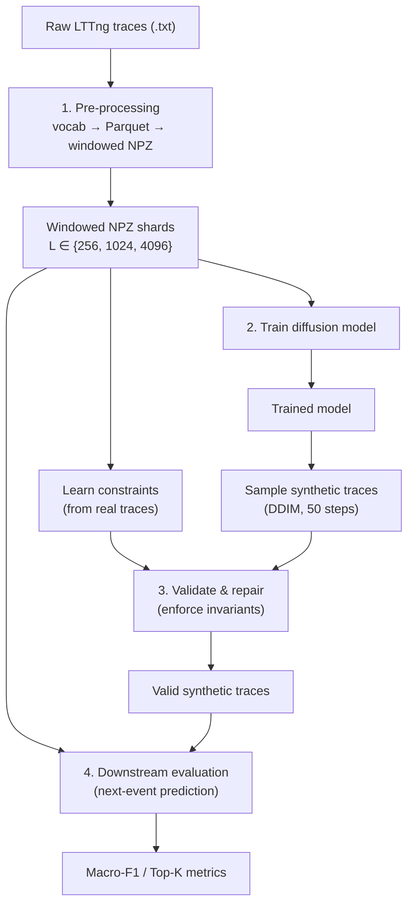

# TraceSynth: Generating Production-Quality Kernel Traces with Constraint-Guided Diffusion Models

> **Research artifact** for the paper *"TraceSynth: Generating Production-Quality Kernel Traces with Constraint-Guided Diffusion Models"*, accepted to the **FSE 2026 Industry Track** (FSE Companion '26, Montreal, QC, Canada).
>
> Yuvraj Sehgal, Sneh Patel, Mahsa Panahandeh, Naser Ezzati-Jivan, and Francois Tetreault.
> DOI: [10.1145/3803437.3805222](https://doi.org/10.1145/3803437.3805222)

TraceSynth is a diffusion-based framework for generating **synthetic kernel execution traces** that augment limited real data for downstream ML tasks such as system diagnostics and anomaly detection. It models traces as **multi-channel sequences** (event types, timestamps, CPU affinity, thread identifiers, and process metadata) using a Transformer-based denoising diffusion process, and enforces system invariants through **constraint-guided repair** learned directly from real traces.

---

## Why TraceSynth?

Collecting production kernel traces is expensive and constrained by runtime overhead (typically 1.5–1.6×), storage demands, privacy policies, and the rarity of long-tail failure modes. TraceSynth addresses this **data scarcity problem** by synthesizing invariant-preserving traces that can be dropped into existing trace-driven analysis pipelines.

### Key findings from the paper

- **Workload dependence.** For deterministic, compute-heavy workloads (`scimark2`), synthetic augmentation reaches **87.2% F1-Macro** at context length *L* = 4096 — only **2.6 points** below the real-only baseline (89.8%). I/O-heavy workloads (`stream`, `iozone`) remain more challenging.
- **Context length is the dominant quality driver.** Moving from *L* = 256 to *L* = 4096 yields a **+104% relative** improvement in macro-F1.
- **Constraint-guided repair is a low-risk safety net.** It improves synthetic data quality by up to **+4.3%**, with the largest gains at short context lengths.
- **Simplicity scales.** Lightweight **2-channel** models (event + time) retain **97–99%** of the performance of full 6-channel models at roughly half the compute cost.

---

## Repository structure

```
SyntheticLogGeneration/
├── data_processing/              # Stage 1: raw LTTng text → Parquet → windowed NPZ + learned constraints
├── synthetic_log_gen/            # Stage 2: Transformer diffusion model + validation/repair
├── experiments_downstream/       # Stage 4: downstream next-event-prediction evaluation
├── dataset/                      # Frozen vocabularies and learned constraints (checked in)
├── train_experiment.py           # Train a diffusion model
├── sample_diffusion.py           # Generate synthetic traces (DDPM / DDIM)
├── run_pipeline.py               # End-to-end augmentation + evaluation pipeline (RQ1/RQ2/RQ3)
├── run_ablation_pipeline.py      # Channel/feature-richness ablation pipeline (RQ4)
├── analyze_pipeline_results.py   # Aggregate main-experiment results
├── analyze_ablation_results.py   # Aggregate ablation results
├── collect_ablation_results.py   # Collect ablation runs into a table
├── requirements.txt              # Python dependencies
└── README.md                     # This file
```

Each subdirectory contains its own detailed README:

- [`data_processing/README.md`](data_processing/README.md) — data pipeline, file formats, scripts
- [`synthetic_log_gen/README.md`](synthetic_log_gen/README.md) — model architecture, training, sampling, repair
- [`experiments_downstream/README.md`](experiments_downstream/README.md) — evaluation methodology and metrics

---

## The TraceSynth pipeline

TraceSynth consists of four stages (Figure 1 in the paper):



1. **Pre-processing** — decode raw LTTng traces into a time-ordered multi-channel event table, freeze vocabularies, store as Parquet, and segment into fixed-length overlapping windows saved as compressed NumPy (`.npz`) shards.
2. **Probabilistic sequence modeling** — a Transformer-based denoising diffusion model learns recurring execution patterns and cross-channel correlations.
3. **Constraint-guided validation & repair** — invariants (valid transitions, temporal bounds, CPU affinity, attribute validity) are mined from real traces and used to validate and repair generated traces post-hoc.
4. **Downstream utility evaluation** — synthetic data is evaluated by training a next-event predictor and measuring macro-F1 on a held-out **real** test set.

---

## Multi-channel trace representation

Each kernel event is represented with **six channels** (the modeling configuration reported in the paper):

| Channel | Meaning | Processing |
|---------|---------|-----------|
| `event` | Event type identifier | Frozen global vocabulary (384 classes) |
| `dt`    | Inter-event time delta (s) | Log-normalized `log(1 + Δt)` |
| `cpu`   | CPU core identifier | Raw categorical |
| `tid`   | Thread identifier | Hashed into 256 buckets (`tid % 256`) |
| `comm`  | Process command name | Frozen `vocab_comm.json` |
| `ret`   | System-call return value | Frozen top-K `vocab_ret.json` |

> The data-processing pipeline additionally extracts and stores a file-descriptor channel (`fd`) in the NPZ shards; the six channels above are the ones used for the experiments reported in the paper. See [`data_processing/README.md`](data_processing/README.md) for the full stored schema.

---

## Quick start

### 1. Install dependencies

```bash
pip install -r requirements.txt
# On the Digital Research Alliance of Canada clusters, use:
# pip install -r requirements_computecanada.txt
```

Requirements: Python 3.8+, PyTorch 2.0+, NumPy, Pandas, PyArrow (full list in `requirements.txt`).

### 2. Get the dataset

TraceSynth is evaluated on the public **LTTng Execution Traces for Ten Phoronix Benchmarks** dataset:

> Alexis Martin and Vania Marangozova-Martin. 2017. *LTTng Execution traces for ten Phoronix benchmarks (part1)*. Zenodo. https://doi.org/10.5281/zenodo.437170

The paper uses **six** benchmarks spanning compute-, memory-, and I/O-intensive workloads: `ffmpeg`, `iozone`, `pybench`, `scimark2`, `stream`, `unpack-linux` (32 runs each). The dataset is **not** included here due to size — download it from Zenodo and follow the setup in [`data_processing/README.md`](data_processing/README.md).

### 3. Process data

Convert raw LTTng traces into windowed NPZ shards and learn constraints (full details and per-script arguments in [`data_processing/README.md`](data_processing/README.md)):

```bash
# Build the global event vocabulary
python data_processing/build_vocab.py \
  --root scratch/txt_traces_all_benchmarks \
  --out_dir dataset/metadata_all_events

# Convert traces to Parquet (run per trace file)
python data_processing/txt_to_enriched_parquet.py \
  --input scratch/txt_traces_all_benchmarks/scimark2/run0.txt \
  --output scratch/enriched_parquet/scimark2/run0.parquet \
  --vocab dataset/metadata_all_events/vocab.json

# Generate windowed NPZ shards (repeat for seq-len 256 / 1024 / 4096)
python data_processing/parquet_to_windowed_npz.py \
  --input-dir scratch/enriched_parquet \
  --output-dir scratch/windowed_npz_4096 \
  --vocab-dir dataset/metadata_all_events \
  --seq-len 4096

# Learn universal constraints from real shards
python data_processing/learn_constraints.py \
  --real_glob "scratch/windowed_npz_4096/**/*.npz" \
  --output dataset/constraints_universal.json \
  --num_events 384
```

### 4. Train a diffusion model

Train one diffusion model per (benchmark, context length). Models are trained separately at *L* ∈ {256, 1024, 4096}:

```bash
python train_experiment.py \
  --data-root scratch/windowed_npz_4096 \
  --benchmark scimark2 \
  --seq-len 4096 \
  --batch-size 8 \
  --epochs 20 \
  --d-model 256 \
  --nhead 8 \
  --num-layers 4 \
  --lr 2e-4 \
  --mixed-precision bf16
```

Checkpoints are written to `logs_tensorboard/<run-name>/ckpt_epoch_*.pt`. See [`synthetic_log_gen/README.md`](synthetic_log_gen/README.md) for the architecture and training details.

### 5. Generate, validate, and repair synthetic traces

```bash
# Sample 10,000 synthetic traces with DDIM (50 steps)
python sample_diffusion.py \
  --ckpt logs_tensorboard/improved_baseline_scimark2_4096/ckpt_epoch_19.pt \
  --out synthetic_traces.npz \
  --num-samples 10000 \
  --seq-len 4096 \
  --use-ddim --ddim-steps 50

# Validate against learned constraints
python synthetic_log_gen/validate.py \
  --trace synthetic_traces.npz \
  --constraints dataset/constraints_universal.json \
  --output validity_report.json

# Repair invariant violations post-hoc
python synthetic_log_gen/repair.py \
  --trace synthetic_traces.npz \
  --constraints dataset/constraints_universal.json \
  --output synthetic_repaired.npz
```

### 6. Run the end-to-end evaluation

`run_pipeline.py` automates data preparation, sampling, repair, dataset combination, downstream training, and metric collection for the main experiments (RQ1–RQ3):

```bash
python run_pipeline.py \
  --benchmark scimark2 \
  --window 4096 \
  --checkpoint-epoch 19 \
  --num-samples 10000
```

For the feature-richness ablation (RQ4), use `run_ablation_pipeline.py`. See [`experiments_downstream/README.md`](experiments_downstream/README.md) for the evaluation protocol.

---

## Reproducing the paper's research questions

| RQ | Question | Where |
|----|----------|-------|
| **RQ1** | When can synthetic traces safely augment limited real data? | `run_pipeline.py` (Real-only vs Combined) → Tables 2–3 |
| **RQ2** | Does constraint-guided repair consistently improve quality? | `run_pipeline.py` (Combined No-Repair vs Repaired) → Table 4 |
| **RQ3** | How does diffusion context length affect quality? | `run_pipeline.py` across *L* ∈ {256, 1024, 4096} → Table 5 |
| **RQ4** | Can simpler (fewer-channel) models match richer ones? | `run_ablation_pipeline.py` (Base / System / Full) → Table 6 |

All RQs are evaluated with a controlled **next-event prediction** task (128-event context, 384-way classification) on a held-out real test set. **Macro-F1** is the primary metric (weighted-F1, accuracy, and Top-5/Top-10 accuracy are reported as secondary metrics).

---

## Experimental setup (as reported)

**Diffusion model.** Transformer encoder denoiser, embedding dimension *d*<sub>model</sub> = 256, 4–8 attention heads, 4–8 layers, *T* = 1000 diffusion steps with a linear β-schedule (β<sub>start</sub> = 1e-4, β<sub>end</sub> = 0.02). Optimized with AdamW (lr = 2e-4, cosine decay), bf16/TF32 mixed precision.

**Sampling.** DDIM with 50 denoising steps; 10,000 synthetic samples per configuration.

**Downstream predictor.** Transformer classifier, *d*<sub>model</sub> = 256, 8 heads, 4 layers; trained up to 20 epochs with AdamW (lr = 1e-4), cross-entropy loss, sliding windows of stride 64, batch size 64, early stopping (patience 3 on validation macro-F1).

**Compute.** Experiments ran on the Nibi cluster (SHARCNET / Digital Research Alliance of Canada), one NVIDIA H100 (80 GB), 8 CPU cores, and 32 GB host memory per job. The approach is not tied to a specific GPU architecture.

---

## Documentation index

- **[`data_processing/README.md`](data_processing/README.md)** — data pipeline, file formats, per-script reference
- **[`synthetic_log_gen/README.md`](synthetic_log_gen/README.md)** — model components, training, DDIM sampling, validation/repair
- **[`experiments_downstream/README.md`](experiments_downstream/README.md)** — downstream evaluation, predictor architectures, metrics

---

## Citation

If you use TraceSynth or this artifact, please cite:

```bibtex
@inproceedings{sehgal2026tracesynth,
  author    = {Yuvraj Sehgal and Sneh Patel and Mahsa Panahandeh and Naser Ezzati-Jivan and Francois Tetreault},
  title     = {{TraceSynth}: Generating Production-Quality Kernel Traces with Constraint-Guided Diffusion Models},
  booktitle = {Companion Proceedings of the 34th ACM Joint European Software Engineering Conference
               and Symposium on the Foundations of Software Engineering (FSE Companion '26)},
  year      = {2026},
  location  = {Montreal, QC, Canada},
  publisher = {Association for Computing Machinery},
  doi       = {10.1145/3803437.3805222}
}
```

The paper is published under a [Creative Commons Attribution 4.0 International License](https://creativecommons.org/licenses/by/4.0/).

---

## Acknowledgments

- **Dataset:** LTTng Execution Traces for Ten Phoronix Benchmarks (Martin & Marangozova-Martin, 2017; Zenodo).
- **Industrial partner:** Ciena Corporation — benchmarks were selected in consultation with Ciena engineers as proxies for network control-plane workloads.
- **Compute:** SHARCNET and the Digital Research Alliance of Canada (Nibi cluster).
- **Frameworks:** PyTorch, Hugging Face Diffusers, Apache Parquet, NumPy.

---

